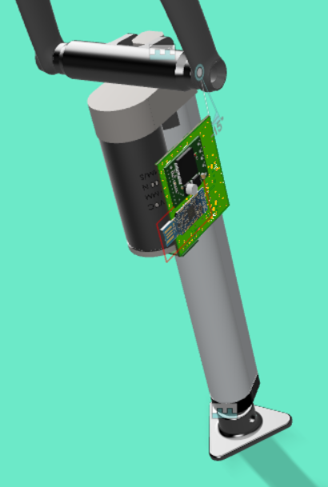

# Project

This is another project of an indoor-trainer grade simulator.  
It is meant to be used with Zwift, but could be used with any other similar program or game.  
The concept was inspired by the Wahoo Kickr Climb, but with different strategy / parts !

- [x] Sensors readout
- [x] ANT+ FE-C Slope sniffing
- [x] Kalman filtering
- [x] Actuator command
- [x] User params flash saving
- [x] Zwift TCP packets sniffing for ERG (or any) mode slope sniffing.

# Concept

The ANT+ target incline is sniffed using the ANT+ protocol, it is then compared to the filtered measured front wheel hub height.  
Two 3D printed parts (in the CAD folder) allow to mount securely the actuator to the bike's fork, and to the ground.  
You know the rest ;-)

## Slope detection

The software can work in 2 modes:  
- The slope is sniffed in Zwift TCP packets directly (preferred, but only works with Zwift...),  
- or it can be obtained from the game ANT+ packets (only works in simulation mode and not in ERG...).

So... pick your poison !

## Incline achievement

The current bike front wheel hub's height is computed using a ToF infrared laser sensor: the VL53L1x.  
These measurement are input in a Kalman filter to get a better dynamic estimate of the bike's incline.  
A VNH5019 is then PWMed to drive the linear actuator.

# Hardware

- MCU: nRF52840 (BLE and ANT+), in the form of the PCA10059 (USB dongle) from Nordic
- Incline detection: ToF laser sensor VL53L1x (Pololu)
- Motor controller: VNH5019 (Pololu)

# How to use it ?

## Hardware connections

The pinout that is used is defined in the file named `custom_board_v1.h`.

## Pre-requisites

### To use the BLE mode

#### Getting the slope from Zwift

- First, you will need a working Node.js install. So go to https://nodejs.org/en/download/ and install it,
- Then you need Win10Pcap (if you are under windows), go to http://www.win10pcap.org/download/,
- Finally, go to the `zpm` folder, and open a terminal. Type `npm install` and press enter. The node modules should start getting installed,
- You can now connect your additional dongle. Check which COM port it occupies and fill it in the Climber.js and Tester.js files.

The node modules should be downloaded and installed automatically.  
You can test your device by using the Tester.js script (`node Tester.js`), which will make your device go up an down every 30 seconds for a few minutes.  
You can use your device with Zwift by typing `node Climber.js` and then starting Zwift as usual.

#### Preparing the nrf52 PC dongle (AP dongle)

You will find the software for this dongle in the following repo:
https://github.com/vincent290587/stravaV10/tree/develop/AP

You can use nRF-Connect to upload the correct softdevice / firmware to the device, or just use the makefile with the following commands:  
`make dfu_softdevice`  
`make dfu_send`

This dongle basically acts as a USB-BLE NUS bridge.  
The softdevice used is specified at the beginning of the makefile.

The LED color codes for the AP dongle are the following:
- blinking green: waiting for USB COM port connection (terminal)
- toggling red: BLE packet received !

## Building the software

- Go to the compil/s340 folder
- Create a `Makefile.local` file with the path to your SDK and the port used for uploading software to the dongle (You can get inspiration from Makefile.local.sample)
- By default the software will get slope information from a second dongle using BLE, but you can also choose to use the ANT+ packets, and to do so you will have to uncomment the line `#CFLAGS += -DANT_STACK_SUPPORT_REQD`. If you are not interested in getting the logs, you might even as well no use BLE at all, and to do so, comment `CFLAGS += -DBLE_STACK_SUPPORT_REQD`.
- Run your favorite `make` command
- Plug your dongle in, and press the little side button to put it in bootloader mode
- Find the name of the dongle port, and make sure it matches the port name given in your `Makefile.local`
- Type `make dfu_softdevice`, which will load the S340 softdevice
- Then type `make dfu`, which will upload the software

The dongle will reboot automagically and it should be running !

### Software editing / tuning

You need a Nordic SDK V15.3 with an equally installed S340 (findable at thisisant.com, and to be put in components/softdevice).
You also need to place the correct ANT / ANT+ keys in your freshly installed SDK ;-)

There are a few parameters you will have to tune to your own setup, although the default values might be ok.  
These are located in the file named `parameters.h`
- `DEFAULT_TARGET_DISTANCE` is the distance measured by the laser sensor when your bike is completely flat (0.0% slope),
- `ACTUATOR_MIN_LENGTH` is the height under which your actuator will never be commanded: aka the low stop,
- `ZWIFT_SLOPE_FACTOR` must be the inverse of Zwift's trainer difficulty.

You will also have to fill in your actuator upward and downward speed in the file `libraries/utils/utils.h` in the function called `map_duty_to_speed`. This is used by the Kalman filter.  
You can use the `Tester.js` script to measure what your actuator can really achieve in terms of speeds, or decide to rely on the datasheet speed of your actuator.

## Full simulation / mock

Yes, the complete system has its own simulator where you can modify settings and look at amazing plots !

!! You need to be using Linux (or WSL on Windows) !!

### Building the simulator

- Go to the TDD folder, and type `cmake ..`
- Then build using `make`
- Run the program `./Climber`

The results are output in a file called `simu.txt`, which you can easily use in a plotting software. (KST plot is warmly recommended, or JSynoptic)

## Using it with Zwift

### If you chose to use ANT+ packets

Congrats ! You are compatible with any training software ! Provided you are using an ANT+ key to connect to your trainer...  
Just power everything up and you should be fine, but one thing to keep in mind: for in Zwift there is a setting called 'trainer difficulty', and it will also reflect on the slope simulated by this device !

For example, if your trainer difficulty is set to 40%, and the current slope in Zwift is 10%, then the device will simulate a 4% incline. Yep.  
To account for this you will have to edit the define `ZWIFT_SLOPE_FACTOR` in `parameters.h`.

### If you chose Zwift TCP packets sniffing (BLE)

Congrats ! You will have the smoothest experience and realistic slope simulation ! But you are only compatile with Zwift...

To be up and running execute the following steps:  
- Follow the pre-requisites to have a working Node.js,
- Plug your second dongle on your computer, its green lights should start blinking,
- Go to the `zpm` folder and open the `Climber.js` file, and change the COM port written in there by the actual COM port of the dongle you just plugged,
- Power the actuator dongle, its light should be solid red,
- The AP dongle red light should start blinking,
- Type in `node Climber.js` in a terminal and press enter,
- You should see logs filling your terminal, which means it is working !

The LED color codes for the actuator dongle are the following:
- red: position stop
- blue / green: going up / down !
