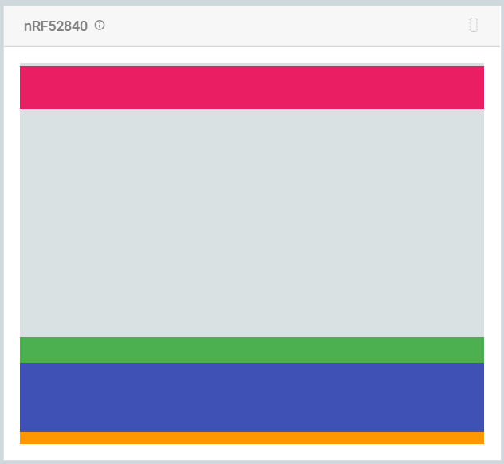

# Compiled programs

These files can easily be flash onto a nRF52 dongle using the Nordic nRF-Connect tool.  
Flash the softdevice first and then proceed with the main program file.  

At the end, the flash should look like this in nRF Connect:  

- orange is the official Nordic MBR
- blue is the softdevice
- green is the application
- pink is the official Nordic dongle bootloader

## Actuator

### Softdevice

ANT_s340_nrf52840_6.1.1.hex

Available on https://www.thisisant.com/developer/components/nrf52832/#tab_protocol_stacks_tab

### Main program

- Device_ANT.hex for ANT+ mode (only possible if trainer connects using an ANT+ dongle key)
- Device_BLE.hex for BLE mode (needs an AP dongle)

## AP (non ANT+ mode)

### Softdevice

s140_nrf52_7.0.1_softdevice.hex

Available on https://www.nordicsemi.com/Products/Development-software/S140/Download?lang=en#infotabs

### Main program

AP.hex
